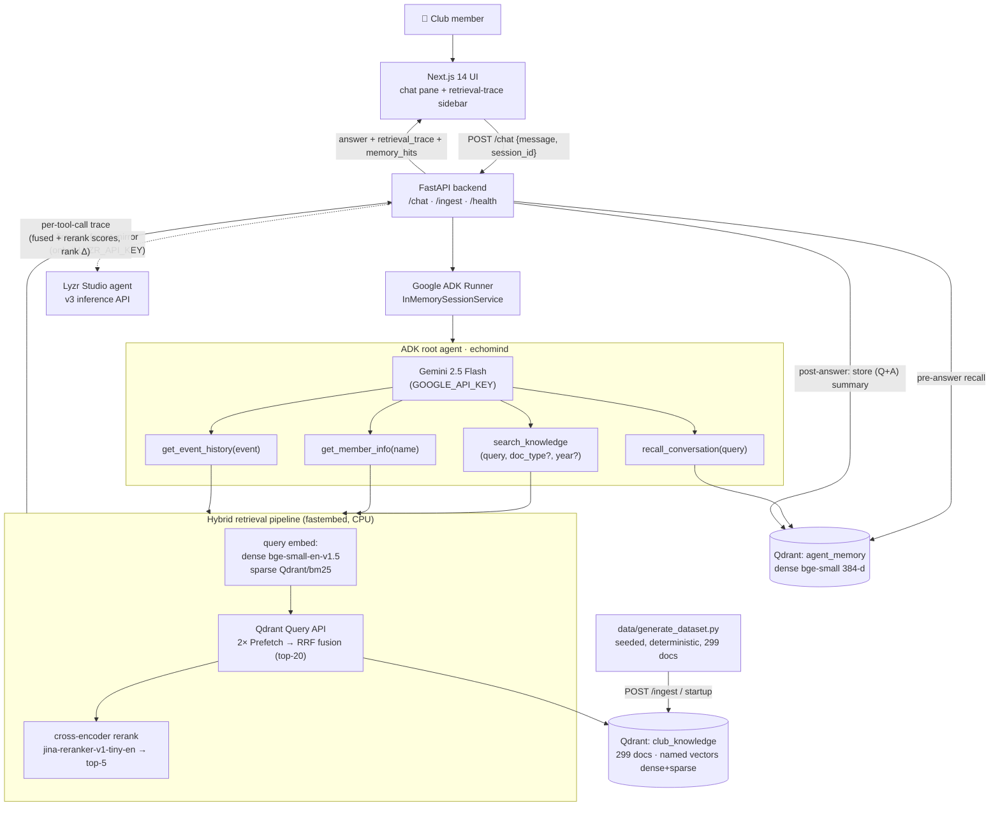

# EchoMind — The Senior Who Never Graduates

> Institutional memory AI agent for college clubs
> **Google Agent Labs Hackathon 2026 · Problem Statement 2: Club & Community Intelligence Agent**

[](https://echomindai.vercel.app)
[](https://drive.google.com/drive/folders/1GVJzmqEvkj0YASq8xz5GMRGNgEnM3SVb?usp=sharing)

**🔗 Live app:** https://echomindai.vercel.app
**🎥 Demo video:** https://drive.google.com/drive/folders/1GVJzmqEvkj0YASq8xz5GMRGNgEnM3SVb?usp=sharing

> Live chat calls a locally-run backend on `localhost:8000` (see [Setup](#setup)); the landing, retrieval-trace UI and demo video are fully live on the hosted link above.

## The problem

Every May, college clubs suffer a lobotomy. The seniors graduate — and with them goes
*everything*: which sponsor ghosted twice, why the 2023 hackathon lost ₹18,000, the trick
that gets budgets approved 3× faster, why membership cratered the year the beginner
workshops stopped. The docs exist — minutes, budgets, post-mortems, handover notes — but
nobody reads 300 documents. So every batch relearns the same expensive lessons.

**EchoMind** ingests a club's full 5-year archive and becomes *the senior you can always
ask*. It answers with citations, synthesizes across years, flags contradictions between
documents, proactively warns about past failures — and remembers its own past
conversations in long-term memory.

The demo dataset is a synthetic but internally consistent history of the fictional
**Nexus Tech Club** (2021–2025): 299 documents across 7 types, with 6 buried storylines
that only cross-document synthesis can recover.

## Architecture as told

```
Next.js 14 UI (chat + live retrieval-trace sidebar)
        │ POST /chat
FastAPI backend
        │
Google ADK root agent "echomind" (Gemini 2.5 Flash)
        │  tools
        ├─ search_knowledge(query, doc_type?, year?)   ┐
        ├─ get_member_info(name)                       │ hybrid retrieval pipeline
        ├─ get_event_history(event_name)               ┘
        └─ recall_conversation(query) ──► Qdrant "agent_memory"
                                          Qdrant "club_knowledge"
                                          (dense bge-small + sparse BM25,
                                           RRF fusion → cross-encoder rerank)
```

### Architecture diagram



Data flow of one question + Qdrant collection schema: [docs/architecture.md](docs/architecture.md).

## How we use Google ADK

The root agent (`backend/agent.py`) is a `google.adk.agents.Agent` on
**gemini-2.5-flash**, run through `Runner` + `InMemorySessionService`. Its four tools are
plain Python functions wrapping the retrieval pipeline. The system instruction encodes
the agent's intelligence: **query decomposition** (multi-topic questions become multiple
focused `search_knowledge` calls), **mandatory citations** (document title + year),
**contradiction flagging** (e.g. the fest-timing conflict between a 2022 and a 2024 doc),
and **proactive failure warnings** (mention TechVerse anywhere near a sponsorship
question). Every tool call is captured into a per-turn trace buffer that the UI renders
live.

## How we use Qdrant

Two collections:

- **`club_knowledge`** — one collection, two named vectors per point:
  `dense` (BAAI/bge-small-en-v1.5, 384-d, cosine) and `sparse` (Qdrant/bm25 with IDF
  modifier), both computed locally with **fastembed** (CPU-only). Queries use the
  **Qdrant Query API** with two `Prefetch` branches fused by **RRF**; the fused top-20
  is reranked to top-5 by a fastembed cross-encoder
  (`jinaai/jina-reranker-v1-tiny-en`). Metadata filters (doc_type, year) are applied
  inside each prefetch branch.
- **`agent_memory`** — after every chat turn, a summary of (question + answer) is
  embedded and stored. Before answering, the backend searches this collection and
  injects relevant past conversations; the agent also has an explicit
  `recall_conversation` tool. This is how EchoMind "remembers" across sessions and
  restarts.

Client resolution: `QDRANT_URL` (cloud) → `localhost:6333` (docker) → **embedded local
mode** (zero-infra fallback; the demo runs with no external services at all).

## How we use Lyzr

`backend/lyzr_integration.py`: if `LYZR_API_KEY` is set, every answered turn is mirrored
to a Lyzr Studio agent (`v3/inference/chat`) as an independent audit/second-opinion
channel — fire-and-forget in a daemon thread, never blocking the main flow. Without the
key it no-ops with a log line.

## Retrieval ablation

15 eval queries targeting the planted storylines, expected-source labels, three configs
(`scripts/ablation.py`):

| Retrieval config | Recall@1 | Recall@5 | MRR@5 |
|---|---|---|---|
| Sparse only (BM25) | 13/15 (87%) | 15/15 (100%) | 0.922 |
| Dense only (bge-small) | 12/15 (80%) | 13/15 (87%) | 0.822 |
| Hybrid RRF + rerank | 14/15 (93%) | 15/15 (100%) | 0.967 |

Dense-only misses keyword-heavy queries ("never rely on", exact sponsor names);
sparse-only mis-ranks paraphrased questions. Hybrid fusion + reranking wins on every
metric.

## Setup

```bash
cp .env.example .env        # add your GOOGLE_API_KEY (Qdrant/Lyzr keys optional)
./run.sh                    # or .\run.ps1 on Windows
```

That single script creates the venv, installs deps, generates the dataset, ingests into
Qdrant (first run), and starts the backend (:8000) + frontend (:3000). Open
**http://localhost:3000**.

Useful extras:

```bash
.venv/Scripts/python scripts/query_cli.py "why did HackNexus 2023 lose money?"   # retrieval proof
.venv/Scripts/python scripts/ablation.py                                         # eval table
curl -X POST localhost:8000/ingest                                               # re-index
```

Without `GOOGLE_API_KEY` the system degrades gracefully to a clearly-labeled
retrieval-only mode (extractive answers, full trace still shown).

Note: in embedded-Qdrant mode the storage dir is single-process — stop the backend
before running `query_cli.py`/`ablation.py`.

## Demo

2.5-minute script with the exact queries: [docs/demo_script.md](docs/demo_script.md).

## Team & roles

Built by four founders, each owning a layer of the stack:

| Founder | Role | Owned |
| --- | --- | --- |
| **Vibhor Pandey** | Founder · Agent & Retrieval | ADK agent design, Gemini integration, hybrid retrieval + cross-encoder rerank pipeline |
| **Bhavya Dubey** | Co-founder · Frontend & Experience | Next.js UI, live retrieval-trace sidebar, 3D/video motion design, Vercel deploy |
| **Yuvraj Arora** | Co-founder · Backend & Infrastructure | FastAPI service, Qdrant collections (`club_knowledge` + `agent_memory`), long-term memory wiring |
| **Rohit Singh Rajawat** | Co-founder · Data & Evaluation | Synthetic dataset generator, retrieval ablation harness, architecture & demo docs |

## Repo map

```
backend/    config, retrieval pipeline, memory, ADK agent, FastAPI app, Lyzr
data/       generate_dataset.py (deterministic, seeded) + club_docs.json (299 docs)
frontend/   Next.js 14 + Tailwind — chat + retrieval-trace sidebar
scripts/    query_cli.py, ablation.py
docs/       architecture.md (Mermaid), demo_script.md
DECISIONS.md  defaults chosen and why
```

## Contributors

- [@vibhorxpandey](https://github.com/vibhorxpandey) — Vibhor Pandey (Founder)
- [@bd9839-source](https://github.com/bd9839-source) — Bhavya Dubey (Co-founder)
- [@YuvrajArora06](https://github.com/YuvrajArora06) — Yuvraj Arora (Co-founder)
- [@singhrajawat017-alt](https://github.com/singhrajawat017-alt) — Rohit Singh Rajawat (Co-founder)
