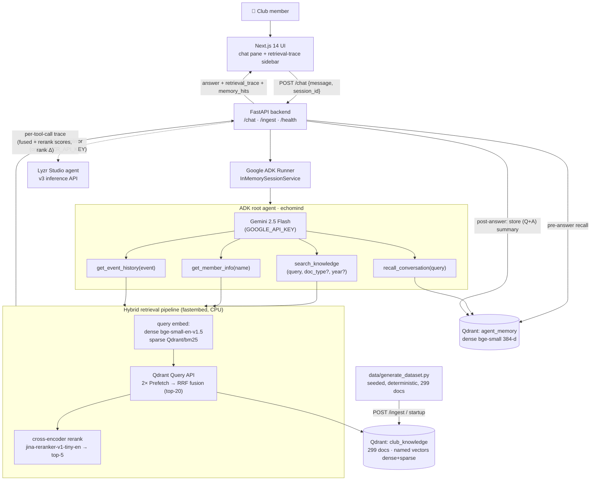

# EchoMind Architecture

## Data flow of one question

1. UI posts the message to `/chat`.
2. Backend searches `agent_memory` first; relevant past conversations are injected as
   context (long-term memory).
3. ADK runner passes the message to the Gemini-powered root agent, which decomposes it
   into one or more tool calls.
4. Each retrieval tool runs the hybrid pipeline: dense + sparse query embedding → Qdrant
   Query API with two prefetch branches → RRF fusion (top-20) → cross-encoder rerank
   (top-5). Every candidate's fused score, rerank score, and rank movement is appended
   to the turn's trace buffer.
5. The agent synthesizes an answer with title+year citations, contradiction flags, and
   past-failure warnings.
6. Backend stores a (Q+A) summary embedding into `agent_memory`, optionally mirrors the
   turn to Lyzr, and returns `{answer, retrieval_trace, memory_hits}` — the UI renders
   the trace sidebar from exactly what the agent saw.

## Qdrant collections

| Collection | Vectors | Contents |
|---|---|---|
| `club_knowledge` | named: `dense` (384-d cosine) + `sparse` (BM25, IDF modifier) | 299 club documents with payload: doc_id, title, doc_type, year, date, author, content |
| `agent_memory` | `dense` (384-d cosine) | one point per past conversation turn: question, summary, session_id, timestamp |

Client fallback chain: Qdrant Cloud (`QDRANT_URL`) → local docker (`localhost:6333`) →
embedded local mode (`qdrant_local_data/`, zero infra).
